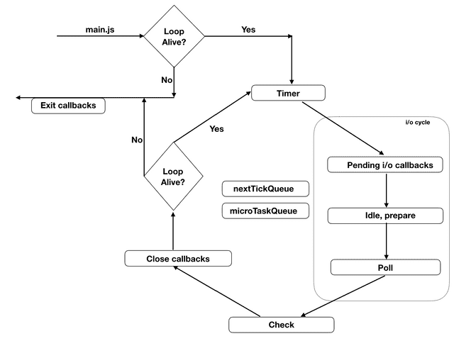

## 해당 자료의 출처
https://evan-moon.github.io/2019/08/01/nodejs-event-loop-workflow/
https://nodejs.org/en/docs/guides/event-loop-timers-and-nexttick/

### 대표적인 오해들

1. 이벤트 루프는 자바스크립트 엔진 내부에 있다
- 이벤트 루프는 단지 자바스크립트 코드를 실행하기 위해 자바스크립트 엔진을 이용하기만 할 뿐이다.
- Node.js나 브라우저가 이벤트 루프를 담당한다

2. 이벤트 루프는 하나의 스택 또는 하나의 큐로만 작동한다
- 이벤트 루프에 작업을 담아놓는 스택 같은 것은 존재하지 않는다.
- 그리고 이벤트 루프가 작동하는 과정은 여러개의 큐를 사용하는 복잡한 과정이다
- 자바스크립트의 모든 콜백이 단 하나의 큐만 사용하여 수행된다는 것은 잘못된 편견이다.

3. 이벤트 루프는 여러 개의 스레드에서 실행된다.
- Node.js의 이벤트 루프는 단일 스레드로 처리한다. 자바스크립트의 실행과 이벤트 루프를 담당하는 별개의 스레드가 있지 않다.

4. setTimeout은 일부 비동기 OS API와 관련있다.
- 이벤트 루프에는 이러한 외부 요인이 따로 있는 것이 아니다. 딜레이가 끝났다고 외부 요인으로 어떤 작업 큐에 들어가는 식이 아니다.

5. setImmediate의 콜백은 작업 큐의 가장 첫번째에 위치한다
- 일반적인 이벤트 루프에 대한 설명은 하나의 큐만 가지고 설명을 진행한다. 따라서 setImmediate()가 콜백을 작업 큐의 가장 앞쪽에 배치하는
API라고 생각하게 된다. 하지만 이것은 완전히 틀렸다. 모든 작업 큐들은 FIFO로만 작동하며 큐에 들어있는 작업의 포지션은 변경되지 않는다.
  
### 이벤트 루프의 구조


위 그림에 표기된 각각의 박스는 특정 작업을 수행하기 위한 페이즈들을 의미한다.   
각 페이즈는 각자 하나의 큐를 가지고 있으며, 자바스크립트의 실행은 이 페이즈들 중 [Idel, prepare] 페이즈를 제외한 어느 단계에서나 할 수 있다.
(사실 자료구조가 큐인지는 확실하지 않다.)
이 그림에서 [nextTickQueue]와 [microTaskQueue]를 볼 수 있는데, 이 큐들은 이벤트 루프의 일부가 아니며,   
이 큐들에 들어있는 작업 또한 어떤 페이즈에서든 실행될 수 있다. 
또한 이 큐들에 들어있는 작업은 가장 높은 실행 우선 순위를 가지고 있다.
이렇듯 이벤트 루프는 각자 다른 여러 개의 페이즈들과 큐들의 조합으로 이루어져 있다.

* Timer phase
    - [Timer phase]는 이벤트 루프의 시작을 알리는 페이즈이다. 이 페이즈가 가지고 있는 큐에는 setTimeout이나 setInterval 같은 타이머들의   
    콜백을 저장하게 된다. 이 페이즈에서 바로 타이머들의 콜백이 큐에 들어가는 아니지만, 타이머들을 min-heap으로 유지하고 있다가 실행할 때가   
    된 타이머들의 콜백을 큐에 넣고 실행하는 것이다.
    - 힙은 완전 이진트리의 일종으로, 어느 정도 느슨한 정렬을 사용하여 최대 값이나 최소 값을 찾아내는 작업에 특화되어 있다. min-heap은   
    상위 레벨의 노드가 하위 레벨의 노드들보다 작거나 같은 구조이므로 타이머가 실행되어야 하는 순서대로 저장하기에 알맞는 자료 구조 이다.
    - 큐에 콜백을 넣는다는 것은 이 콜백들을 실행하겠다는 것을 의미한다. 타이머가 생성되자마자 큐에 콜백을 넣은 것이 아니라, 별도의 힙에   
    타이머를 저장하고나서 매 Timer phase 때 어떤 타이머가 실행할 때가 되었는지를 검사한 후, 실행되어야 하는 콜백만 큐에 넣는다는 것이다.

* Pending i/o callback phase
    - 이 페이즈에서는 이벤트 루프의 [pending_queue]에 들어있는 콜백들을 실행한다. 이 큐에 들어와있는 콜백들은 현재 돌고 있는 루프 이전에   
    한 작업에서 이미 큐에 들어와 있던 콜백들이다.
    - 예를 들어, TCP 핸들러 콜백 함수에서 파일에 뭔가를 썼다면 TCP 통신이 끝나고 파일 쓰기도 끝나고 나서 파일 쓰기의 콜백이 이 큐에 들어온다.
      (파일쓰기는 보통 비동기로 이뤄진다) 또한 에러 핸들러 콜백도 [pending_queue]로 들어오게 된다.

* Idle, Prepare phase
    - 이름은 [Idle phase] 이지만 이 페이즈는 매 Tick마다 실행된다. [Prepare phase] 또한 매 폴링(Polling)때마다 실행된다.
    - 이 두개의 페이즈는 이벤트 루프와 직접적인 관련이 있다기 보다는 Node.js의 내부적인 관리를 위한 것이다.
    
* Poll phase : 중요!
    - 이 페이즈에서는 새로운 수신 커넥션(새로운 소켓 설정 등)과 데이터(파일 읽기 등)을 허용한다. 여기서 일어나는 일은 크게 두가지 이다
        1. 만약 [watch_queue](Poll phase 가 가지고 있는 큐)가 비어있지 않다면, 큐가 비거나 시스템 최대 실행 한도에 다다를 때까지
        동기적으로 모든 콜백을 실행한다
        2. 일단 [watch_queue]가 비어있다면, Node.js는 곧바로 다음 페이즈로 넘어가는 것이 아니라 약간 대기시간을 가지게 된다.
        Node.js가 기다리는 시간은 여러 가지 요인에 따라 계산된다.
           
* Check phase 
    - [Poll phase]의 다음 페이즈는 바로 [setImmediate]의 콜백만을 위한 페이즈인 [Check phase]이다. 

* Close callbacks
    - socket.on('close', () => {})과 같은 close 이벤트 타입의 핸들러들은 여기서 처리된다.

* nextTickQueue 와 microTaskQueue
    - [nextTickQueue]는 [process.nextTick()] API의 콜백들을 가지고 있으며, [microTaskQueue]는 Resolve된 프로미스의 콜백을 갖는다.
    - 이 두개의 큐는 기술적으로 이벤트 루프의 일부가 아니다. 즉, libuv 라이브러리가 아니라 Node.js에 포함된 기술이다.
    - libuv는 Node.js에서 사용하는 비동기 I/O 라이브러리다. 이 라이브러리는 C로 작성되었고 윈도우나 리눅스 커널을 추상화해서 래핑하고 있다.
    - 즉, 커널에서 처리할 수 있는 비동기 작업을 발견하면 바로 커널로 작업을 넘긴다.
    - 이후 이 작업들이 종료되어 OS 커널로부터 시스템 콜을 받으면 이벤트 루프에 콜백을 등록하는 것이다.
    - 만약 OS 커널이 지원하지 않는 작업일 경우 별도의 스레드에 작업을 던져서 처리한다.
    

### 이벤트 루프의 작업 흐름
Node.js는 js 파일을 실행했을 때, 이벤트 루프를 생성한 다음 이벤트 루프 바깥에서 메인 모듈인 js파일을 실행한다. 
한번 메인 모듈이 실행되고나면 Node.js는 이벤트 루프가 활성 상태인지, 즉 이벤트 루프 안에서 해야할 작업이 있는지를 확인한다.
만약 이벤트 루프를 돌릴 필요가 없다면 Node.js는 process.on('exit', ()=>{})를 실행하고 이벤트 루프를 종료하려고 할 것이다.

> 그러나 만약 이벤트 루프를 돌려야 하는 상황이라면, Node.js는 이벤트 루프의 첫 번째 페이즈인 [Timer phase]를 실행한다.



#### Timer phase
이벤트 루프가 Timer phase에 들어가게 되면 실행할 타이머 콜백 큐에 뭐가 있는 지 확인부터 시작한다. 
그냥 확인이라고 하면 간단해보이지만 사실 이벤트 루프는 적절한 콜백들을 찾기 위해 몇 가지 단계를 수행하게된다. 
위에서 설명했듯이 타이머 스크립트는 오름차순으로 힙에 저장된다. 
그래서 제일 먼저 저장된 타이머들을 하나씩 까서 now - registeredTime === delta 같은 조건을 통해 
타이머의 콜백을 실행할 시간이 되었는 지 검사하게 된다.(delta는 setTimeout(() => {}, 10)에서의 10)

만약 조건에 해당된다면 이 타이머의 콜백을 실행하고 다음 타이머를 확인한다. 
만약 조건에 해당하지 않는 타이머를 만난다면, 탐색을 바로 종료하고 다음 페이즈로 이동한다. 
타이머는 힙 내부에 오름차순으로 정렬되어있기 때문에 그 이후로는 탐색을 해도 의미가 없기 때문이다.

자, 예를 들어 딜레이 값이 100, 200, 300, 400인 4개의 타이머(A, B, C, D)를 어떤 특정 시간 t에 힙에 등록했다고 가정해보자.
> | A |  -> | B | -> | C | -> | D |

이제 이벤트 루프가 t+250에 Timer phase에 진입했다고 생각해보자.
가장 먼저 타이머 A를 찾아낸 후 만료 기간이 t+100이라는 것을 알게 될 것이다. 
그러나 지금은 이미 t+250이기 때문에 타이머 A의 콜백은 실행될 것이다. 
그리고 타이머 B를 찾아내어 만료 기간이 t+200임을 체크하게되고, 타이머 B의 콜백 역시 실행된다.
이제 타이머 C를 체크하게 되는데 이 타이머의 딜레이는 t+300이기 때문에 바로 페이즈가 종료된다. 
이벤트 루프는 타이머 D는 체크하지 않는데, 위에서 설명했듯이 타이머들은 만료 기간 순으로 오름차순 정렬되어있기 때문에 
타이머 C의 뒤쪽에는 어차피 타이머 C보다 만료 기간이 긴 타이머들만 있기 때문이다.
참고로 페이즈는 시스템의 실행 한도에도 영향을 받고 있으므로, 실행 되어야하는 타이머가 아직 남아 있다고 하더라도 
시스템 실행 한도에 도달한다면 바로 다음 페이즈로 넘어가게된다.

#### Pending i/o phase
타이머 페이즈가 종료된 후 이벤트 루프는 Pending i/o 페이즈에 진입한다.
가장 먼저 이전 작업들의 콜백이 실행 대기 중인지, 즉 pending_queue에 들어와 있는지 체크한다.
만약 실행 대기 중이라면 pending_queue가 비거나 시스템의 실행 한도 초과에 도달할 때까지 대기하고 있던 콜백들을 실행한다.
이 과정이 종료되면 이벤트 루프는 [Idle handler phase]로 이동하게 된 후, 내부 처리를 위한 [Prepare phase]를 거쳐
최종적으로 가장 중요한 단계인 [Poll Phase]에 도달하게 된다.

#### Poll phase 
이 페이즈는 폴링하는 단계이다. 이벤트 루프가 [Poll phase]에 들어왔을 때 watcher_queue 내부에 파일 읽기의 응답 콜백,
HTTP 응답 콜백 같이 수행해야 할 작업들이 있다면 이 작업들을 실행하게 된다. 이 과정 또한 watcher_queue가 비거나 
시스템의 실행 한도 초과에 다다를 때까지 계속 된다.

만약 더 이상 콜백들을 실행할 수 없는 상태가 된다면 check_queue, pendinig_queue, closing_callback_queue에 해야할 작업이 있는지를 
검사하고, 만약 해야할 작업이 있다면 바로 Poll phase가 종료되고 다음 페이즈로 넘어가게 된다. 하지만 특별히 해야할 작업이 더 이상 없는 경우
Poll phase는 다음 페이즈로 넘어가지 않고 계속 대기하게 괸다.

이때도 마냥 무한 대기를 하는 것은 아니고, 타이머 힙에서 첫번째 타이머를 꺼내본 다음에 만약 해당 타이머가 실행 가능한 상태라면 
그 타이머의 딜레이 시간 만큼만 대기 시간을 결정한다.

결국 Poll phase에서 더 이상 수행할 작업이 없는 경우 다음 페이즈로 넘어가는 조건은 다음과 같다.
1. Check phase에 실행할 콜백이 있다면 다음 페이즈로 넘어간다
2. Check phase에 실행할 콜백이 없다면 타이머가 있는지를 확인한다.
3. 타이머가 있다면 타이머를 실행할 수 있는 시간이 될 떄까지만 대기하고 바로 Timer phase로 간다.
4. 없다면 일이 생길때 까지 대기한다.

> 2번 조건에서 타이머가 있다고 바로 Timer phase로 넘어가지 않고 대기하는 이유는, 대기하지 않고 바로 넘어갈 경우   
> 어차피 첫 번째 타이머를 실행할 수 있는 시간이 안되었기 때문에 Timer phase에서도 아무것도 수행하지 않고 페이즈가 끝나버리기 때문이다
> 그렇게 되면 굳이 이벤트 루프를 한번 더 돌아야지 해당 타이머를 실행할 수 있게 되기 때문에 Poll phase에 그대로 대기하는 것이 효율적이다.


#### Check phase
[Poll phase]가 지나면 이벤트 루프는 바로 setImmediate() API의 콜백과 관련있는 [Check phase]에 들어서게 된다.
이 페이즈에서는 다른 페이즈와 마찬가지로 큐가 비거나 시스템 실행 한도 초과에 도달할 때까지 계속 해서 setImmediate의 콜백들을 실행한다.

#### Close callback
[Check phase]가 종료된 후 이벤트 루프의 목적지는 close나 destroy 콜백 타입들을 관리하는 Close callback이다.
이벤트 루프가 Close callback 들과 함께 종료되고 나면 이벤트 루프는 다음에 돌아야 할 루프가 있는지 다시 체크하게 된다.
만약 아니라면 그대로 이벤트 루프는 종료된다. 하지만 더 수행해야할 작업들이 남아있다면 이벤트 루프는 다음 순회를 돌기 시작하고
다시 [Timer phase] 부터 시작하게 된다.

위에서 설명했던 [Timer phase]에서의 예시를 다시 가져오자면, 이제 다음 루프의 [Timer phase]에서는 타이머 C의 만료 시간이 경과했는지부터 확인한다.


#### nextTickQueue & microTaskQueue
근데 이벤트 루프의 일부가 아닌 이 두 큐에 들어있는 콜백들은 언제 실행되는 걸까? 
이 두 큐의 콜백들은 어떤 페이즈에서 다음 페이즈로 넘어가기 전에 자신이 가지고 있는 콜백들을 최대한 빨리 실행해야하는 역할을 맡고 있다.
(역주: 페이즈에서 다른 페이즈로 넘어가는 과정을 Tick이라고 부른다.)
다른 페이즈들과는 다르게 이 두 큐는 시스템 실행 한도 초과에 영향을 받지 않기 때문에 
Node.js는 이 큐가 완전히 비워질 때까지 콜백들을 실행한다. 그리고 nextTickQueue는 microTaskQueue보다는 높은 우선 순위를 가지고 있다.

 
#### Thread-pool
필자가 자바스크립트 개발자에게 가장 많이 들은 단어는 바로 스레드풀(ThreadPoll)이다. 
그리고 이와 관련된 가장 큰 오해는 바로 Node.js가 모든 비동기 명령을 관리하는 별도의 스레드풀을 가지고 있다는 것이다. 
그러나 이 스레드풀은 Node.js가 아니라 Node.js가 비동기 작업을 처리하기 위해 사용하는 라이브러리인 libUV에 포함된 기능이라는 것이다.

필자가 이벤트 루프의 다이어그램에 스레드풀을 별도로 표시하지 않은 이유는 스레드풀 자체가 이벤트 루프 매커니즘의 일부가 아니기 때문이다. 
libUV는 OS커널의 비동기 API만을 사용하여 이벤트 드리븐을 유도할 수 있을 만큼 충분히 훌륭하다. 
그러나 파일 읽기, DNS Lookup 등 OS 커널이 비동기 API를 지원하지않는 작업들의 경우에는 별도의 스레드풀을 사용하게 되는데, 
이때 기본 값으로 4개의 스레드를 사용하도록 설정되어있다. uv_threadpool 환경 변수를 사용하면 최대 128개까지 스레드 개수를 늘릴 수도 있다.


### Workflow with examples
#### Snippet 1 – 기초 이해
```javascript
setTimeout(() => {
    console.log('setTimeout');
}, 0);
setImmediate(() => {
  console.log('setImmediate');
});
```
위 결과를 예측할 수 있겠는가? 아마도 여러분은 setTimeout이 먼저 출력된다고 생각하겠지만, 사실 장담할 수 없다.
왜냐? 메인 모듈이 실행되고나서 이벤트 루프가 Timer phase에 진입할 때 여러분의 타이머를 찾을 수도 있고 못 찾을 수도 있기 때문이다. 
왜냐면 타이머는 시스템의 시간과 사용자가 제공한 시간을 사용하여 등록되기 때문이다. setTimeout이 호출된 순간, 
타이머는 메모리에 이 타이머를 저장하게되는데, 그 순간 컴퓨터의 성능이나 Node.js가 아닌 외부 작업 때문에 약간의 딜레이가 발생할 수 있기 때문이다.

또 다른 포인트는 Node.js가 Timer phase에 진입하기 전에 변수 now를 선언하고 그 변수 now를 현재 시간으로 간주한다는 점이다. 
그러므로 정확한 계산이라고 하기에는 약간의 노이즈가 껴있다는 것이고, 
이게 바로 setTimeout이 반드시 먼저 실행될 것이라고 확신할 수 없는 불확실성의 이유가 된다.
그러나 만약 여러분이 이 코드를 I/O 사이클의 내부로 옮긴다면, 반드시 setTimeout보다 setImmediate가 먼저 실행되는 것을 보장할 수 있게된다.

```javascript
fs.readFile('my-file-path.txt', () => {
  setTimeout(() => {
    console.log('setTimeout');
  }, 0);
  setImmediate(() => {
    console.log('setImmediate');
  });
});
```
위 코드는 다음의 순서로 실행된다.
1. fs.readFile 을 만나면 이벤트 루프는 libuv에게 해당 작업을 전달한다.
2. 파일 읽기는 OS 커널에서 비동기 API를 제공하지 않기 때문에 libuv는 별도의 스레드에 해당 작업을 전달한다.
3. 작업이 완료되면 이벤트 루프는 Pending i/o callback phase의 pending_queue에 작업의 콜백을 등록한다.
4. 이벤트 루프가 Pending i/o callback phase를 지날 때 해당 콜백을 실행한다.
5. setTimeout 이 Timer phase의 큐에 등록된다. 해당 콜백은 다음 Timer phase 때 실행될 것이다.
6. setImmediate의 콜백이 Check phase의 check_queue에 등록된다.
7. Poll phase에서는 딱히 할 일이 없지만, Check phase의 큐에 작업이 있으므로 바로 Check phase로 이동한다.
8. setImmediate 콘솔 출력. Timer phase에는 타이머가 등록되어 있으므로 다시 이벤트 루프가 시작된다.
9. Timer phase 에서 타이머를 검사, 딜레이가 0이므로 setTimeout의 콜백을 바로 실행한다.
10. setTimeout 콘솔이 출력된다.

이런 과정을 거치기 때문에 setImmediate의 콜백이 반드시 setTimeout보다 먼저 실행되는 것을 보장할 수 있다.

#### Snippet 2 – 타이머들을 더 잘 이해하기
```javascript
let i = 0;
let start = new Date();
function foo () {
    i++;
    if (i < 1000) {
        setImmediate(foo);
    } else {
        let end = new Date();
        console.log("Execution time: ", (end - start));
    }
}
foo();
```
위 예시에서 함수 foo는 setImmediate()에 의해서 1000번 재귀호출 되고 있다. 실행해보면 6ms 정도가 소요된다.
위 코드를 setImmediate(foo) 에서 setTimeout(foo, 0)으로 변경해보자.

```javascript
let i = 0;
let start = new Date();
function foo () {
    i++;
    if (i < 1000) {
        setTimeout(foo, 0);
    } else {
        let end = new Date();
        console.log("Execution time: ", (end - start));
    }
}
foo();
```
걸리는 시간이 1000ms 이상 늘어난다.
위 두 경우 모두 Polling에 걸리는 시간은 0인데 결과에서는 큰 차이가 난다.
그 이유는 바로 시간을 비교하고 편차를 알아내는 작업이 CPU를 집중적으로 사용하는 작업이기 때문에 시간이 더 오래 걸리기 때문이다.
게다가 타이머 스크립트를 등록하는 것 자체도 시간을 소모한다.
Timer phase에서는 타이머를 실행할 시간이 되었는지, 콜백을 실행해야 하는지를 검사하기 위해 몇가지 작업을 거쳐야 하는데 
이 과정을 매 이터레이션마다 하고 있으니 느려질 수 밖에 없다. 
그러나 setImmediate의 경우 이런 과정이 필요없기 때문에 setTimeout보다 실행 속도가 빠른 것이다.

#### Snippet 3 – nextTick()과 타이머 실행에 대해 이해하기

```javascript
let i = 0;
function foo(){
  i++;
  if(i>20){
    return;
  }
  console.log("foo");
  setTimeout(()=>{
    console.log("setTimeout");
  },0);
  process.nextTick(foo);
}   
setTimeout(foo, 2);
```
위 코드는 첫번째 출력에서 foo가 나오고, 이후 setTimeout 들이 출력된다. 제일 처음 코드를 실행하면 2ms 후에 첫 번째 foo가 출력되고
다음 nextTickQueue 에 다시 foo()를 넣게 된다.
그리고 nextTickQueue에 들어간 콜백들은 한 페이즈에서 다음 페이즈로 넘어갈 때마다 무조건 콜백들을 동기적으로 실행해야한다. 
그렇기 때문에 재귀호출로 nextTickQueue에 들어간 모든 콜백들을 실행하고 나서야 Timer Phase에서 setTimeout 콜백을 처리할 수 있게 되는 것이다.

코드를 약간 수정해서 살펴보자.
```javascript
let i = 0;
function foo(){
  i++;
  if(i>20){
    return;
  }
  console.log("foo", i);
  setTimeout(()=>{
    console.log("setTimeout", i);
  },0);
  process.nextTick(foo);
}

setTimeout(foo, 2);
setTimeout(()=>{
  console.log("Other setTimeout");
}, 2);
```
기존의 setTimeout과 같은 딜레이 시간을 가진 setTimeout을 추가했고, 이 타이머의 콜백은 단지 Other setTimeout을 출력하기만 한다. 
뭐, 확실하다고 말할 수는 없지만 한 개의 foo가 먼저 출력된 후 Other setTimeout이 출력될 찬스가 존재하긴 한다. 
타이머들이 들어있는 힙 내부에 동일한 딜레이를 가진 타이머들은 어떻게든 그룹화되어있고, 
nextTickQueue의 체크는 진행 중인 콜백 그룹의 실행이 끝난 후에야 진행되기 때문이다.

첫 번째 setTimeout의 콜백과 두 번째 setTimeout의 콜백이 실행될 시간이 동일하기 때문에 Timer phase에서 두 타이머의 콜백이 모두 큐에 들어갔고,
일단 큐에 들어갔으면 시스템 실행 한도에 걸리지 않는 이상 무조건 해당 페이즈가 끝나기 전에 실행된다.

이런 경우, foo() 내부의 process.nextTick의 콜백은 Timer phase에서 다음 페이즈로 넘어갈 때 실행될 것이기 때문에
foo가 먼저 한 개 출력되고 Other setTimeout이 출력되는 것이다.

### 몇 가지 일반적인 질문들

#### 자바스크립트는 정확히 어디에서 실행되는가?
이벤트 루프 자체에서 V8 또는 다른 엔진을 사용하여 자바스크립트를 실행하는 것이고 이때, 
단 하나의 스레드를 사용하여 자바스크립트가 실행되는 것이다. 실행 자체는 동기적이고, 
현재 실행시킨 자바스크립트의 실행이 완료되지 않는다면 이벤트 루프 또한 진행되지 않는다.

#### 왜 우리는 setTimeout(fn, 0)가 있는데도 setImmediate를 사용해야 하나요?
일단, setTimeout(fn, 0)은 실질적으로 0이 아니다. 이건 사실 1이다. 
여러분이 타이머의 딜레이를 1ms보다 작거나 2147483647ms보다 크게 설정하면 딜레이는 자동으로 1로 세팅된다. 
그렇기 때문에 setTimeout의 딜레이를 0으로 설정하려고 한다면 이 딜레이는 자동으로 1이 되는 것이다.

이미 설명했던 대로 setImmediate을 사용하면 타이머를 사용할 때처럼 딜레이의 시간이 지났지 뭐니 하는 추가적인 체크 로직이 필요없어진다. 
그래서 setImmediate은 빠른 것이다. 또한 setImmediate의 체크 작업은 Poll phase 직후에 수행되기 때문에 
HTTP 요청 콜백과 같은 곳에서 사용된 setImmediate의 콜백 함수는 바로 실행된다고 할 수 있다.

#### 왜 setImmediate는 Immediate(즉시)라고 부르는 건가요?
setImmediate와 process.nextTick 모두 이름이 잘못 되었다고 생각한다. 사실 setImmediate은 한번의 Tick 또는 루프가 돌 때마다 관리되고, 
nextTick은 한 페이즈에서 다음 페이즈로 넘어가는 매 Tick마다 최대한 빨리 호출되도록 작동하고 있다. 
그래서 기능적으로는 setImmediate이 nextTick이라는 이름이 더 잘 어울리고 nextTick이 진짜로 즉시(Immediately) 호출되는 친구다.

#### 자바스크립트는 Block될 수 있는건가요?
이미 위에서 설명했듯이 nextTickQueue는 콜백 실행에 있어서 어떤 제한도 가지고 있지 않다. 
그렇기 때문에 만약 process.nextTick()이 재귀 호출된다면, 여러분의 프로그램은
다른 페이즈들의 큐가 어떤 콜백을 가지고 있든간에 절대 그 작업에서 빠져나오지 못할 것이다.

#### 만약 Exit callback phase에서 setTimeout을 호출하면 어떻게 되나요?
뭐, 타이머 자체는 시작될 수 있겠지만 setTimeout의 콜백은 절대 호출되지 않을 것이다. 
이미 Node.js가 Exit callbacks에 들어와 있다는 것은 이미 이벤트 루프에서 빠져나왔다는 것을 의미한다.


## 정리

* 이벤트 루프는 작업 스택을 가지고 있지 않다.
* 이벤트 루프가 별도의 스레드에서 실행되고 자바스크립트 실행은 어떤 큐에서 하나씩 꺼내와서 다른 곳에서 하는 것이 아니라 
  자바스크립트의 실행 자체가 이벤트 루프 안에서 수행되는 것이다.
* setImmediate는 콜백을 작업 큐의 앞 쪽에 밀어넣는 것이 아니라 setImmediate 만을 처리하기 위한 전용 페이즈와 큐가 존재한다.
* setImmediate은 실질적으로 다음 페이즈 혹은 다음 이벤트 루프의 순회에서 실행되고, nextTick이 오히려 실질적으로 더 빠르게 실행된다.
* nextTickQueue에 담긴 작업이 재귀 호출을 수행하는 경우 Node.js의 작업 프로세스를 블록킹할 수 있다. 주의하도록 하자.

